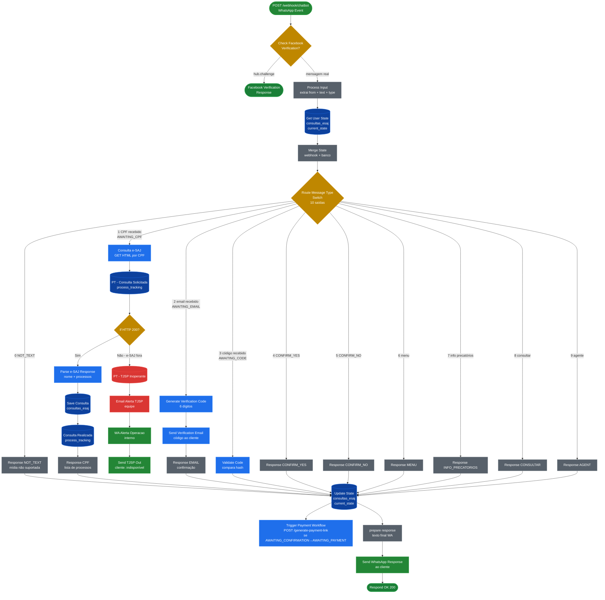
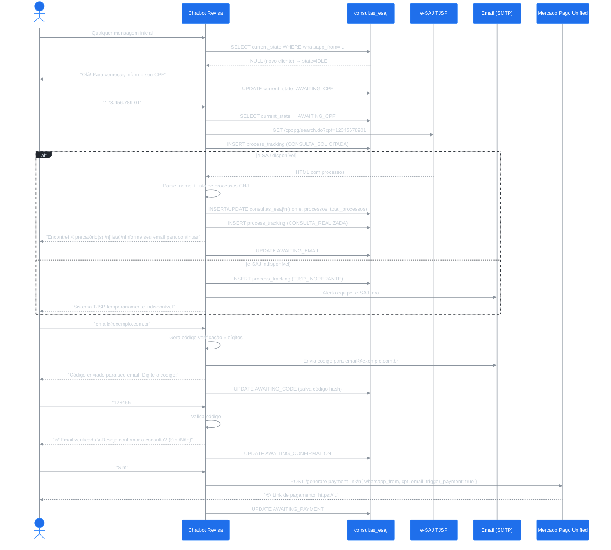
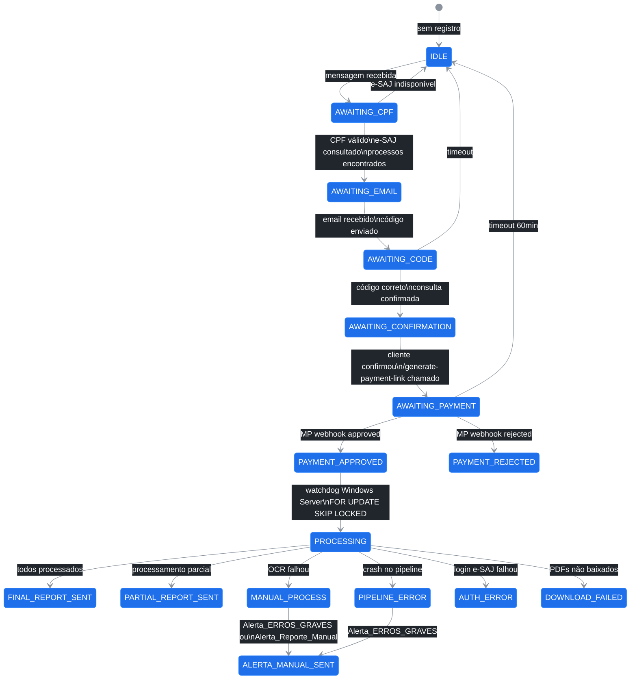

# Workflow: Chatbot Revisa

**ID n8n:** `bXqi8RykpGxXMBGE`
**Trigger:** `POST /webhook/chatbot` (WhatsApp Cloud API)
**Status:** ✅ Ativo
**Descrição:** Ponto de entrada da plataforma. Recebe mensagens WhatsApp, gerencia estado da conversa e conduz o cliente desde a identificação por CPF até o pagamento do laudo.

---

## Nós (35 nós)

| Nó | Tipo | Função |
|---|---|---|
| `Webhook Trigger` | webhook | Recebe eventos WhatsApp + verificação Facebook |
| `Check Facebook Verification` | if | Separa challenge de verificação FB vs mensagem real |
| `Facebook Verification Response` | respondToWebhook | Responde `hub.challenge` ao Facebook |
| `Process Input` | code | Extrai `from`, `text`, `type` da mensagem |
| `Get User State` | postgres | SELECT `current_state` de `consultas_esaj` |
| `Merge State` | set | Une dados do webhook + estado do banco |
| `Route Message Type` | switch | Roteador central — 10 saídas por estado+mensagem |
| `Response NOT_TEXT` | set | Mensagem para mídia/áudio não suportados |
| `Consulta e-SAJ` | httpRequest | GET HTML por CPF no e-SAJ TJSP |
| `PT - Consulta Solicitada` | postgres | INSERT `process_tracking` (CONSULTA_SOLICITADA) |
| `If HTTP 200?` | if | Verifica se e-SAJ respondeu OK |
| `Parse e-SAJ Response` | code | Extrai nome e processos do HTML |
| `Save Consulta` | postgres | INSERT/UPDATE `consultas_esaj` |
| `Consulta Realizada` | postgres | INSERT `process_tracking` (CONSULTA_REALIZADA) |
| `Response CPF` | set | Monta resposta com lista de processos |
| `Generate Verification Code` | code | Gera código numérico 6 dígitos |
| `Send Verification Email` | emailSend | Envia código ao email informado |
| `Response EMAIL` | set | Monta resposta de confirmação de email |
| `Validate Code` | code | Valida código digitado pelo cliente |
| `Response CODE` | set | Resposta para código correto/errado |
| `Response CONFIRM_YES` | set | Resposta para confirmação positiva |
| `Response CONFIRM_NO` | set | Resposta para confirmação negativa |
| `Response MENU` | set | Resposta para "menu" |
| `Response INFO_PRECATORIOS` | set | Informações sobre precatórios |
| `Response CONSULTAR` | set | Início de nova consulta |
| `Response AGENT` | set | Resposta de agente/suporte |
| `Update State` | postgres | UPDATE `consultas_esaj.current_state` |
| `Trigger Payment Workflow` | httpRequest | POST `/generate-payment-link` ao Mercado Pago |
| `prepare response` | code | Prepara texto final da resposta WA |
| `Send WhatsApp Response` | whatsApp | Envia mensagem ao cliente |
| `Respond OK` | respondToWebhook | Responde 200 ao webhook do FB |
| `PT - TJSP Inoperante` | postgres | Registra indisponibilidade do e-SAJ |
| `Email Alerta TJSP` | emailSend | Notifica equipe: e-SAJ fora |
| `WA Alerta Operacao TJSP` | whatsApp | WA interno: e-SAJ fora |
| `Send TJSP Out` | whatsApp | WA ao cliente: sistema indisponível |

---

## Flowchart

---

## Diagrama de Sequência — Conversa Completa

---

## Máquina de Estados

---

## Roteador Central (Route Message Type — Switch)

| Saída | Condição | Estado Atual → Próximo |
|---|---|---|
| 0 | `type != text` | qualquer → mantém |
| 1 | CPF válido recebido | `AWAITING_CPF` → `AWAITING_EMAIL` |
| 2 | Email recebido | `AWAITING_EMAIL` → `AWAITING_CODE` |
| 3 | Código numérico recebido | `AWAITING_CODE` → `AWAITING_CONFIRMATION` |
| 4 | "sim" / confirmação | `AWAITING_CONFIRMATION` → `AWAITING_PAYMENT` |
| 5 | "não" / negação | `AWAITING_CONFIRMATION` → `IDLE` |
| 6 | "menu" | qualquer → `IDLE` |
| 7 | "precatório" / info | qualquer → mantém |
| 8 | "consultar" | qualquer → `AWAITING_CPF` |
| 9 | qualquer outro | qualquer → mantém |

---

## Tabelas Afetadas

| Tabela | Operação |
|---|---|
| `consultas_esaj` | INSERT (novo cliente) + UPDATE (state a cada mensagem) |
| `process_tracking` | INSERT (CONSULTA_SOLICITADA, CONSULTA_REALIZADA, TJSP_INOPERANTE) |

---

## Notas Importantes

- **Verificação Facebook:** O webhook do WhatsApp Cloud API também recebe um `GET` com `hub.challenge` para verificação. O nó `Check Facebook Verification` separa esse caso e responde diretamente com o challenge sem processar como mensagem.
- **Trigger Payment:** O `Trigger Payment Workflow` só é chamado quando `current_state` transita para `AWAITING_PAYMENT` — não em todas as atualizações de estado.
- **e-SAJ indisponível:** Se o e-SAJ retornar status != 200, o workflow notifica a equipe internamente e responde ao cliente com mensagem de indisponibilidade, sem fazer retry automático.
