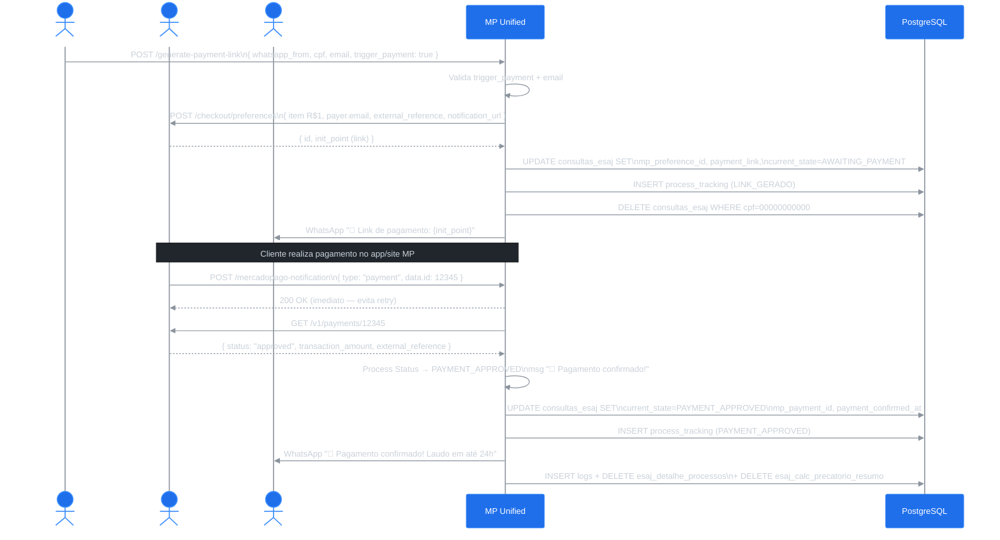

# Workflow: Mercado Pago Unified

**ID n8n:** `6COT3ubybyI8QhYT`
**Status:** ✅ Ativo
**Dois fluxos independentes em um único workflow:**

| Fluxo | Endpoint | Chamado por |
|---|---|---|
| A — Geração de link | `POST /webhook/generate-payment-link` | Chatbot Revisa |
| B — Notificação MP | `POST /webhook/mercadopago-notification` | Mercado Pago (callback) |

---

## Nós (15 nós)

### Fluxo A — Geração de Link

| Nó | Tipo | Função |
|---|---|---|
| `Generate Link Webhook` | webhook | Recebe pedido de link do Chatbot |
| `Validate Trigger Payment` | if | Valida `trigger_payment=true` + email preenchido |
| `Generate Payment Link` | httpRequest | POST MP API `/checkout/preferences` |
| `Save Payment Link` | postgres | UPDATE `consultas_esaj` com `mp_preference_id`, `payment_link`, `AWAITING_PAYMENT` |
| `PT Link Gerado` | postgres | INSERT `process_tracking` (LINK_GERADO) |
| `Cleanup Session Record` | postgres | DELETE `consultas_esaj WHERE cpf='00000000000'` |
| `Send Payment Link WA` | whatsApp | Envia link ao cliente |
| `Log Skipped Payment` | code | Encerra silenciosamente se `trigger_payment=false` |

### Fluxo B — Notificação de Pagamento

| Nó | Tipo | Função |
|---|---|---|
| `Webhook` | webhook | Recebe callback do Mercado Pago |
| `Respond OK to MP` | respondToWebhook | **Responde 200 imediatamente** (evita retry storm) |
| `Filter Payment Events` | if | Filtra apenas `type=payment` |
| `Get Payment Details` | httpRequest | GET MP API `/v1/payments/{id}` |
| `Process Payment Status` | code | Mapeia status: approved/rejected/pending → workflow_state + mensagem WA |
| `Update Payment Status` | postgres | UPDATE `consultas_esaj` com `current_state`, `mp_payment_id` |
| `PT Status Pagamento` | postgres | INSERT `process_tracking` (PAYMENT_APPROVED/REJECTED) |
| `Send WhatsApp Notification` | whatsApp | Notifica cliente sobre status |
| `Log Payment Success` | postgres | INSERT logs + **DELETE OCR e cálculo antigos** |
| `Log Ignored Event` | code | Encerra silenciosamente para eventos não-pagamento |

---

## Flowchart

```mermaid
flowchart TD
    subgraph A["Fluxo A — Geração de Link"]
        WH1([POST\n/generate-payment-link]) --> VT{Validate\ntrigger_payment=true\n+ email?}
        VT -->|Não| SK[Log Skipped]
        VT -->|Sim| GL[Generate Payment Link\nPOST MP API\n/checkout/preferences\nR$ 1,00]
        GL --> SL[(Save Payment Link\nconsultas_esaj\nmp_preference_id\nAWAITING_PAYMENT)]
        SL --> PT1[(PT Link Gerado\nprocess_tracking\nLINK_GERADO)]
        PT1 --> CL[(Cleanup Session\nDELETE cpf=00000000000)]
        CL --> WA1[Send Payment Link WA\n🔗 link ao cliente]
    end

    subgraph B["Fluxo B — Notificação de Pagamento"]
        WH2([POST\n/mercadopago-notification]) --> RES[Respond OK 200\nimediato]
        WH2 --> FP{Filter\ntype=payment?}
        FP -->|Não| IGN[Log Ignored]
        FP -->|Sim| GPD[Get Payment Details\nGET /v1/payments/id]
        GPD --> PPS[Process Payment Status\napproved → PAYMENT_APPROVED\nrejected → PAYMENT_REJECTED\npending → PAYMENT_PENDING]
        PPS --> UPS[(Update Payment Status\nconsultas_esaj\ncurrent_state + mp_payment_id)]
        UPS --> PTP[(PT Status Pagamento\nprocess_tracking)]
        PTP --> WA2[Send WhatsApp\nNotification]
        WA2 --> LPS[(Log Payment Success\nlogs INSERT\n+ DELETE esaj_detalhe_processos\n+ DELETE esaj_calc_precatorio_resumo)]
    end

    classDef entrada fill:#238636,color:#fff,stroke:#2ea043
    classDef wf      fill:#1f6feb,color:#fff,stroke:#388bfd
    classDef banco   fill:#0d419d,color:#fff,stroke:#1f6feb
    classDef sucesso fill:#1a7f37,color:#fff,stroke:#2da44e
    classDef alerta  fill:#da3633,color:#fff,stroke:#f85149
    classDef cinza   fill:#57606a,color:#fff,stroke:#6e7781
    classDef decisao fill:#bf8700,color:#fff,stroke:#d29922

    class WH1,WH2,WA1,WA2 entrada
    class VT,FP decisao
    class RES sucesso
    class SK,IGN cinza
    class GL,GPD,PPS wf
    class SL,PT1,CL,UPS,PTP banco
    class LPS alerta
```



---

## Diagrama de Sequência



---

## Detalhes Importantes

**Body enviado ao MP:**
```json
{
  "items": [{ "title": "Laudo Completo de Precatórios", "quantity": 1, "currency_id": "BRL", "unit_price": 1.00 }],
  "payer": { "email": "{email_cliente}" },
  "external_reference": "{whatsapp_from}_{timestamp}",
  "notification_url": "https://n8n.srv987902.hstgr.cloud/webhook/mercadopago-notification",
  "back_urls": {
    "success": "https://revisaprecatorio.com.br/pagamento-sucesso",
    "failure": "https://revisaprecatorio.com.br/pagamento-falha"
  }
}
```

**DELETE ao confirmar pagamento** (nó `Log Payment Success`):
```sql
DELETE FROM esaj_detalhe_processos
WHERE cpf = (SELECT cpf FROM consultas_esaj WHERE mp_external_reference = '{ref}' LIMIT 1);

DELETE FROM esaj_calc_precatorio_resumo
WHERE cpf = (SELECT cpf FROM consultas_esaj WHERE mp_external_reference = '{ref}' LIMIT 1);
```
> Garante que dados de uma consulta anterior do mesmo CPF não contaminem o novo processamento.

---

## Tabelas Afetadas

| Tabela | Fluxo A | Fluxo B |
|---|---|---|
| `consultas_esaj` | UPDATE (link + AWAITING_PAYMENT) + DELETE sessão | UPDATE (current_state + mp_payment_id) |
| `process_tracking` | INSERT LINK_GERADO | INSERT PAYMENT_APPROVED/REJECTED |
| `esaj_detalhe_processos` | — | DELETE (ao aprovar) |
| `esaj_calc_precatorio_resumo` | — | DELETE (ao aprovar) |
| `logs` | — | INSERT |
