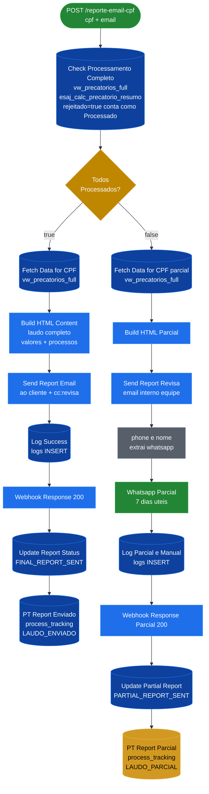
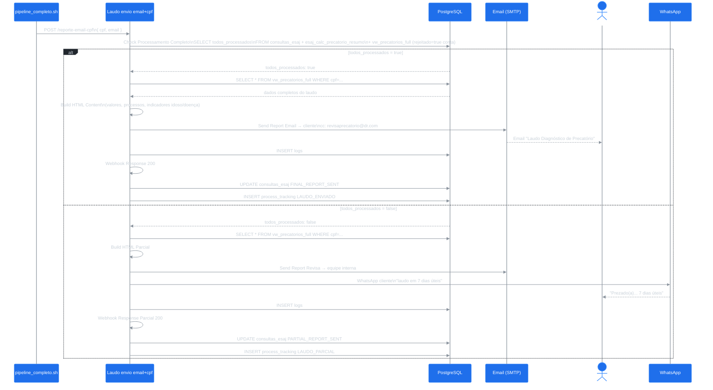

# Workflow: Laudo envio email+cpf

**ID n8n:** `(ver JSON)`
**Trigger:** `POST /webhook/reporte-email-cpf`
**Status:** ✅ Ativo
**Chamado por:** `calc-precatorio-tjsp/main.py` (via `pipeline_completo.sh`) e pela **Etapa 9b** do pipeline para CPFs 100% rejeitados.

---

## Nós (19 nós)

### Caminho Principal (todos processados)

| Nó | Tipo | Função |
|---|---|---|
| `Webhook Email + CPF` | webhook | Recebe `{ cpf, email }` |
| `Check Processamento Completo` | postgres | Verifica se todos os processos foram processados ou rejeitados |
| `Todos Processados?` | if | Bifurca: `todos_processados = true/false` |
| `Fetch Data for CPF` | postgres | `SELECT * FROM vw_precatorios_full WHERE cpf = ...` |
| `Build HTML Content` | function | Gera HTML completo do laudo |
| `Send Report Email` | emailSend | Envia laudo ao cliente (cc: revisaprecatorio) |
| `Log Success` | postgres | INSERT `logs` |
| `Webhook Response` | respondToWebhook | Responde 200 com resumo |
| `Update Report Status` | postgres | UPDATE `FINAL_REPORT_SENT` |
| `PT Report Enviado` | postgres | INSERT `process_tracking` (LAUDO_ENVIADO) |

### Caminho Parcial (nem todos processados)

| Nó | Tipo | Função |
|---|---|---|
| `Fetch Data for CPF - parcial` | postgres | `SELECT * FROM vw_precatorios_full WHERE cpf = ...` |
| `Build HTML Parcial` | function | Gera HTML parcial do laudo |
| `Send Report Revisa` | emailSend | Envia cópia interna para equipe |
| `phone e nome` | set | Extrai whatsapp_phone_number e nome |
| `Whatsapp Parcial` | whatsApp | Notifica cliente: "laudo em 7 dias úteis" |
| `Log Parcial e Manual` | postgres | INSERT `logs` |
| `Webhook Response Parcial` | respondToWebhook | Responde 200 parcial |
| `Update Partial Report` | postgres | UPDATE `PARTIAL_REPORT_SENT` |
| `PT Report Parcial` | postgres | INSERT `process_tracking` (LAUDO_PARCIAL) |

---

## Flowchart



---

## Diagrama de Sequência



---

## Lógica de `Check Processamento Completo`

Esta é a query mais importante do workflow. Determina se o laudo é completo ou parcial:

```sql
WITH consulta_alvo AS (
    SELECT * FROM consultas_esaj
    WHERE cpf = '{cpf}' AND email = '{email}'
      AND current_state NOT IN ('REPORT_SENT', 'FINAL_REPORT_SENT')
    ORDER BY created_at DESC LIMIT 1
),
processos_esperados AS (
    SELECT ..., p.value ->> 'numero' AS numero_processo
    FROM consulta_alvo CROSS JOIN LATERAL jsonb_array_elements(c.processos -> 'lista') p
),
status_processos AS (
    SELECT ...,
        CASE
            WHEN r.numero_processo_cnj IS NOT NULL THEN 'Processado'  -- tem cálculo
            WHEN COALESCE(vp.rejeitado, false) = true THEN 'Processado'  -- rejeitado conta!
            ELSE 'Não Processado'
        END AS status_calculo
    FROM processos_esperados pe
    LEFT JOIN esaj_calc_precatorio_resumo r ON r.numero_processo_cnj = pe.numero_processo
    LEFT JOIN vw_precatorios_full vp ON vp.numero_processo_cnj = pe.numero_processo
)
SELECT ..., BOOL_AND(status_calculo = 'Processado') AS todos_processados
```

> **Ponto-chave:** `rejeitado = true` é considerado "Processado" — garante que CPFs 100% rejeitados recebam laudo completo (não parcial) quando acionados pela Etapa 9b.

---

## Etapa 9b — Trigger para CPFs 100% Rejeitados

Quando `calc-precatorio-tjsp/main.py` não gera nenhum registro em `esaj_calc_precatorio_resumo` (todos os processos rejeitados), o `pipeline_completo.sh` aciona este webhook diretamente:

```bash
# Etapa 9b em pipeline_completo.sh
curl -s --connect-timeout 10 --max-time 30 \
  -X POST "${N8N_WEBHOOK_BASE}/webhook/reporte-email-cpf" \
  -H "Content-Type: application/json" \
  -d "{\"cpf\": \"${CPF}\", \"email\": \"${EMAIL}\"}"
```

O workflow detecta `todos_processados = true` (via `rejeitado = true` conta como processado) e envia o laudo normalmente.

---

## Tabelas Afetadas

| Tabela | Operação |
|---|---|
| `consultas_esaj` | R (check) + UPDATE (FINAL/PARTIAL_REPORT_SENT) |
| `esaj_calc_precatorio_resumo` | R (check) |
| `vw_precatorios_full` | R (dados do laudo) |
| `process_tracking` | INSERT (LAUDO_ENVIADO / LAUDO_PARCIAL) |
| `logs` | INSERT |
