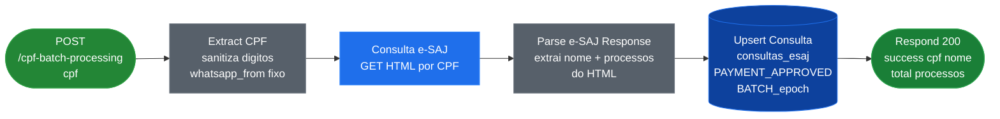
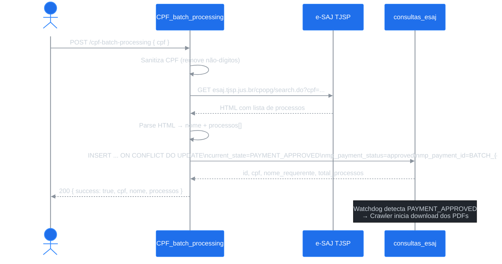

# Workflow: CPF_batch_processing

**ID n8n:** `jMzstMZfztUMz7O6`
**Trigger:** `POST /webhook/cpf-batch-processing`
**Status:** ✅ Ativo
**Uso:** Cadastro administrativo de CPFs sem passar pelo fluxo WhatsApp/pagamento. Insere diretamente com `current_state = PAYMENT_APPROVED` para forçar o processamento pelo crawler.

---

## Nós (6 nós)

| Nó | Tipo | Função |
|---|---|---|
| `Webhook Trigger` | webhook | Recebe `{ cpf }` via POST |
| `Extract CPF` | set | Sanitiza CPF (apenas dígitos), define `whatsapp_from` fixo |
| `Consulta e-SAJ` | httpRequest | GET e-SAJ por CPF — retorna HTML |
| `Parse e-SAJ Response` | code | Extrai nome e lista de processos do HTML |
| `Upsert Consulta` | postgres | INSERT/UPDATE `consultas_esaj` com `PAYMENT_APPROVED` |
| `Respond to Webhook` | respondToWebhook | Retorna JSON com resultado |

---

## Flowchart



---

## Diagrama de Sequência



---

## Detalhes Técnicos

**URL e-SAJ consultada:**
```
https://esaj.tjsp.jus.br/cpopg/search.do?cbPesquisa=DOCPARTE&dadosConsulta.valorConsulta={cpf}&cdForo=-1
```

**SQL Upsert:**
```sql
INSERT INTO consultas_esaj (
  whatsapp_from, whatsapp_phone_number, cpf, nome_requerente,
  processos, total_processos, resposta_formatada,
  current_state, mp_payment_status, mp_payment_id, mp_payment_amount,
  payment_confirmed_at, ...timestamps...
)
VALUES (...)
ON CONFLICT (whatsapp_from, cpf) DO UPDATE SET
  nome_requerente = EXCLUDED.nome_requerente,
  processos = EXCLUDED.processos,
  current_state = EXCLUDED.current_state,
  mp_payment_status = EXCLUDED.mp_payment_status,
  ...
RETURNING id, cpf, nome_requerente, total_processos
```

> **Nota:** `mp_payment_id` é gerado como `BATCH_{epoch}` e `mp_payment_amount = 1.00` para simular pagamento aprovado sem passar pelo Mercado Pago.

---

## Tabelas Afetadas

| Tabela | Operação |
|---|---|
| `consultas_esaj` | INSERT / UPDATE (upsert) |

---

## Exemplo de Request/Response

**Request:**
```json
POST https://n8n.srv987902.hstgr.cloud/webhook/cpf-batch-processing
{ "cpf": "12345678901" }
```

**Response:**
```json
{
  "success": true,
  "cpf": "12345678901",
  "nome": "JOAO DA SILVA",
  "total_processos": 2,
  "processos": [
    { "numero": "0001234-56.2020.8.26.0053", "classe": "Precatório" },
    { "numero": "0007890-12.2019.8.26.0053", "classe": "Precatório" }
  ],
  "status_pagamento": "PAYMENT_APPROVED"
}
```
