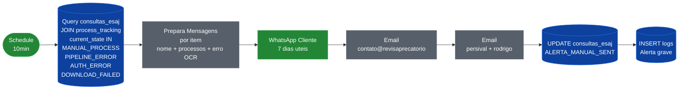
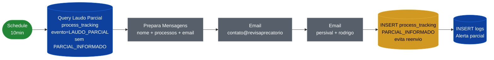
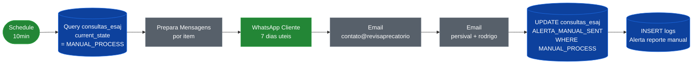
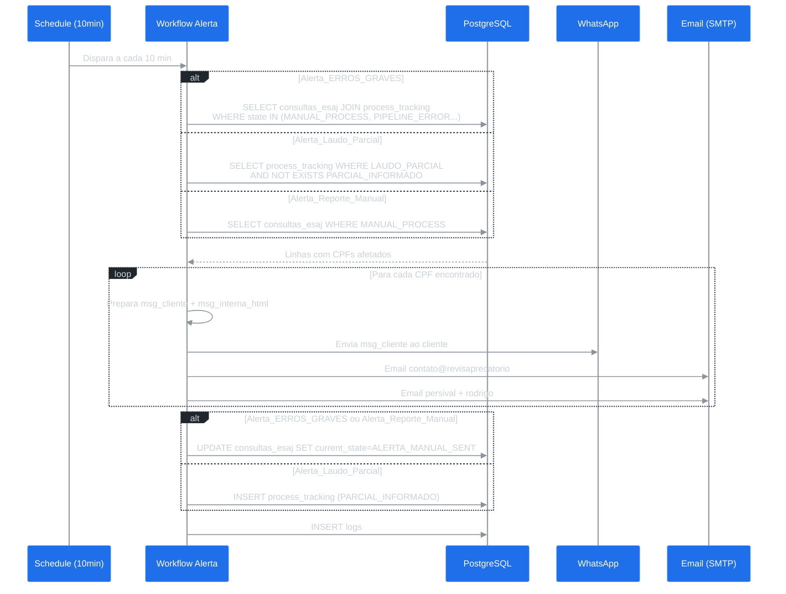

# Workflows de Alerta (Monitoramento)

Três workflows agendados que rodam a cada 10 minutos para monitorar estados de erro e notificar equipe e clientes.

---

## Índice

| Workflow | ID n8n | Detecta | Nós |
|---|---|---|---|
| [Alerta_ERROS_GRAVES](#alerta_erros_graves) | `GnL3nOy64DmpjHTD` | MANUAL_PROCESS, PIPELINE_ERROR, AUTH_ERROR, DOWNLOAD_FAILED | 8 |
| [Alerta_Laudo_Parcial](#alerta_laudo_parcial) | `nWttny9O5BjKabz2` | LAUDO_PARCIAL sem PARCIAL_INFORMADO | 7 |
| [Alerta_Reporte_Manual](#alerta_reporte_manual) | `XIx9gn1ifI7jsyoP` | MANUAL_PROCESS | 8 |

---

## Alerta_ERROS_GRAVES

**Detecta:** CPFs com `current_state IN (MANUAL_PROCESS, PIPELINE_ERROR, AUTH_ERROR, DOWNLOAD_FAILED)`
**Ação:** Notifica cliente via WhatsApp + equipe interna por email (2 destinatários)
**Estado final:** `ALERTA_MANUAL_SENT`

### Flowchart



### Query de Detecção

```sql
SELECT
    ce.id AS consulta_id, ce.cpf, ce.current_state,
    ce.whatsapp_from, ce.nome_requerente, ce.email, ce.processos,
    STRING_AGG(DISTINCT pt.mensagem_erro, ' | ') AS erros_ocr
FROM consultas_esaj ce
LEFT JOIN process_tracking pt
    ON pt.consulta_id = ce.id
    AND pt.evento = 'OCR_ERRO'
    AND pt.mensagem_erro IS NOT NULL
WHERE ce.current_state IN ('MANUAL_PROCESS','PIPELINE_ERROR','AUTH_ERROR','DOWNLOAD_FAILED')
GROUP BY ce.id, ce.cpf, ce.current_state, ce.whatsapp_from, ce.nome_requerente, ce.email, ce.processos
```

---

## Alerta_Laudo_Parcial

**Detecta:** Registros com evento `LAUDO_PARCIAL` em `process_tracking` que ainda **não** têm `PARCIAL_INFORMADO` (sem alerta duplicado)
**Ação:** Email interno para equipe — reprocessamento manual necessário
**Estado final:** INSERT `PARCIAL_INFORMADO` em `process_tracking`

### Flowchart



### Query de Detecção (Anti-Duplicata)

```sql
SELECT pt.id as pt_id, pt.consulta_id, pt.cpf,
       ce.whatsapp_from, ce.nome_requerente, ce.email, ce.processos
FROM process_tracking pt
JOIN consultas_esaj ce ON ce.cpf = pt.cpf
WHERE pt.evento = 'LAUDO_PARCIAL'
AND NOT EXISTS (
    SELECT 1 FROM process_tracking pt2
    WHERE pt2.cpf = pt.cpf
      AND pt2.consulta_id IS NOT DISTINCT FROM pt.consulta_id
      AND pt2.evento = 'PARCIAL_INFORMADO'
)
ORDER BY ce.created_at ASC
```

---

## Alerta_Reporte_Manual

**Detecta:** CPFs com `current_state = MANUAL_PROCESS`
**Ação:** Notifica cliente via WhatsApp + equipe interna por email
**Estado final:** `ALERTA_MANUAL_SENT`

> **Diferença de `Alerta_ERROS_GRAVES`:** Detecta apenas `MANUAL_PROCESS` (sem os outros estados de erro) e atualiza via `WHERE current_state = 'MANUAL_PROCESS'` (batch) em vez de por `consulta_id`.

### Flowchart



---

## Diagrama de Sequência Comparativo



---

## Tabelas Afetadas

| Tabela | Alerta_ERROS_GRAVES | Alerta_Laudo_Parcial | Alerta_Reporte_Manual |
|---|---|---|---|
| `consultas_esaj` | R + UPDATE | R | R + UPDATE |
| `process_tracking` | R (LEFT JOIN) | R + INSERT | — |
| `logs` | INSERT | INSERT | INSERT |

---

## Mensagem ao Cliente (WhatsApp)

```
Prezado(a) {nome_requerente} recebemos a sua solicitação e informamos que,
devido a uma instabilidade do sistema do Tribunal de Justiça do Estado de
São Paulo, o seu laudo diagnóstico de precatório será enviado em até 7
(sete) dias úteis.

Contamos com a sua compreensão e agradecemos o contato.

Atenciosamente,
Revisa Precatório
```
