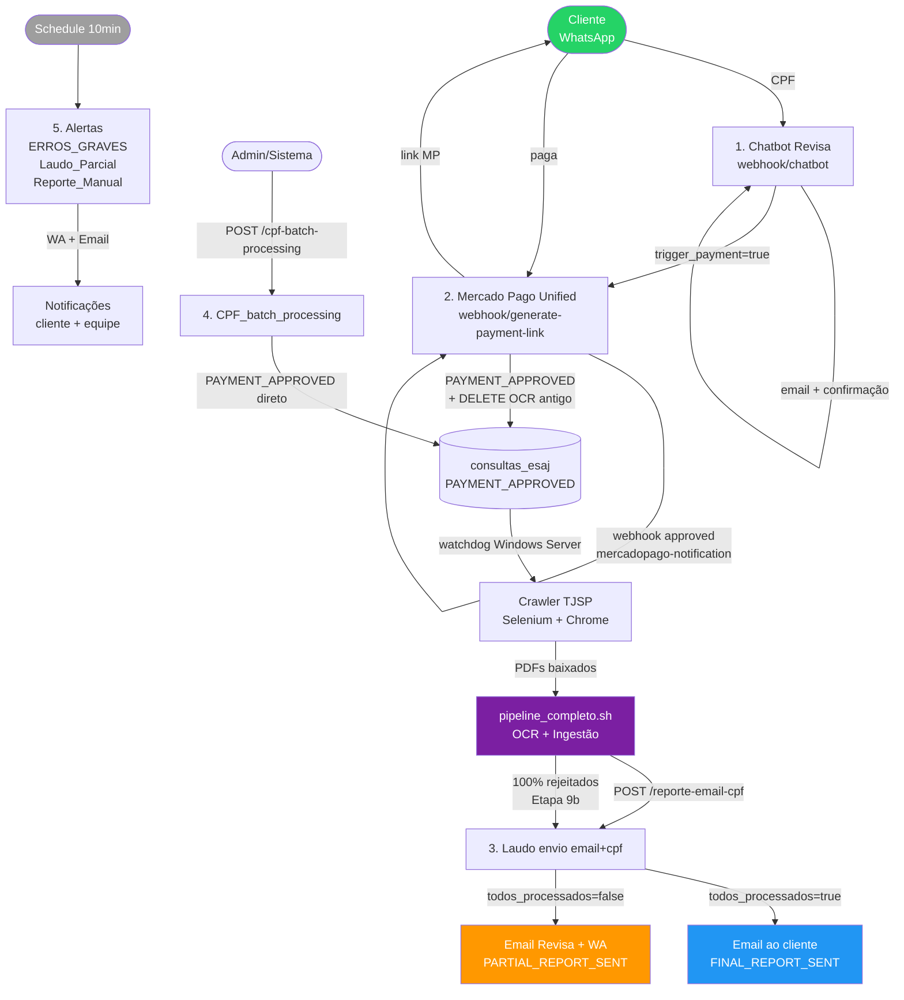
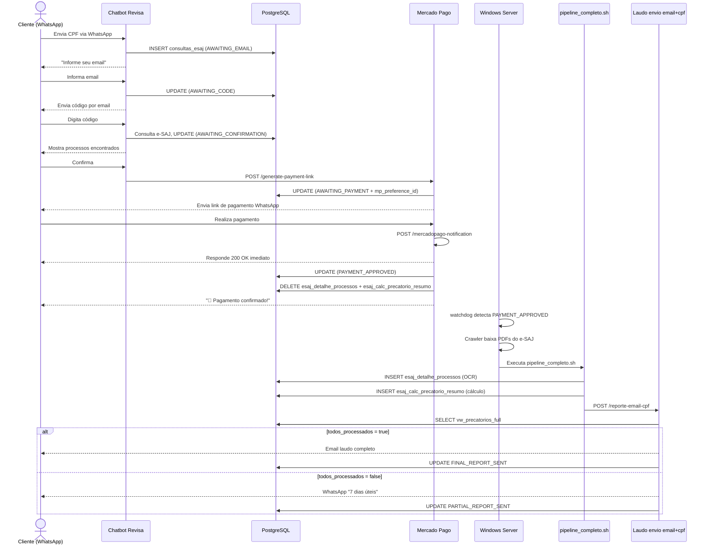

# Workflows n8n — Revisa Precatório

Documentação detalhada de todos os workflows ativos no n8n. Os JSONs exportados estão em `workflows_n8n/`.

**Instância n8n:** `https://n8n.srv987902.hstgr.cloud`
**Última atualização:** 2026-06-11

---

## Índice e Ordem de Execução na Plataforma

| # | Arquivo | Workflow | Trigger | Status |
|---|---------|----------|---------|--------|
| 1 | [01_chatbot_revisa.md](01_chatbot_revisa.md) | Chatbot Revisa | WhatsApp webhook | ✅ Ativo |
| 2 | [02_mercado_pago.md](02_mercado_pago.md) | Mercado Pago Unified | Webhook (2 endpoints) | ✅ Ativo |
| 3 | [03_laudo_envio.md](03_laudo_envio.md) | Laudo envio email+cpf | Webhook POST | ✅ Ativo |
| 4 | [04_cpf_batch_processing.md](04_cpf_batch_processing.md) | CPF_batch_processing | Webhook POST | ✅ Ativo |
| 5 | [05_alertas.md](05_alertas.md) | Alerta_ERROS_GRAVES | Schedule 10min | ✅ Ativo |
| 5 | [05_alertas.md](05_alertas.md) | Alerta_Laudo_Parcial | Schedule 10min | ✅ Ativo |
| 5 | [05_alertas.md](05_alertas.md) | Alerta_Reporte_Manual | Schedule 10min | ✅ Ativo |

---

## Fluxo Completo da Plataforma

---

## Diagrama de Sequência — Jornada Completa do Cliente

---

## Tabelas Afetadas por Workflow

| Tabela | Chatbot | MP Unified | Laudo | Batch | Alertas |
|--------|---------|------------|-------|-------|---------|
| `consultas_esaj` | R/W | R/W | R/W | W | R/W |
| `process_tracking` | W | W | W | — | W |
| `esaj_detalhe_processos` | — | DELETE | R | — | — |
| `esaj_calc_precatorio_resumo` | — | DELETE | R | — | — |
| `logs` | — | W | — | — | W |

---

## Credenciais Utilizadas

| Credencial | Tipo | Usada em |
|---|---|---|
| `Postgres account` (b0F0gRzrpEq6BR3M) | PostgreSQL | Todos |
| `WhatsApp account` (ejhZtEKHF0Kh9HeQ) | WhatsApp API | Chatbot, MP, Alertas |
| `Mercado Pago API` (KytrAZe3o5ngsDTa) | HTTP Header Auth | MP Unified |
| `SMTP revisa` (QhA560IeJvTVywaS) | SMTP | Laudo, Alertas |
